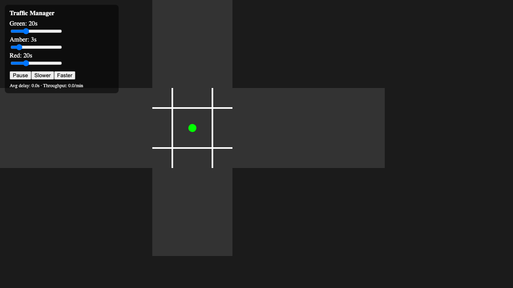

# Traffic Manager

2D-игра: управляй светофорами, минимизируй пробки и ожидание пешеходов.

## Demo
👉 https://damir224.github.io/TrafficManager/



## Локальный запуск
```bash
npm ci
npm run dev
```

## Сборка

```bash
npm run build
npm run preview
```

## Тесты

```bash
npm test
npm run e2e
```

## Стек

TypeScript, Vite, Phaser 3, React, Zustand. Деплой — GitHub Pages.

## Архитектура
- `src/simulation`: контроллер светофора, спавн трафика, движение, пешеходы, метрики, фиксированный шаг 100ms.
- `src/render`: сцена Phaser, примитивный отрисовщик перекрёстка и ТС.
- `src/ui`: React HUD с настройками фаз и скоростей, метрики.
- `src/workers`: заглушка для A* маршрутизации (будущее расширение).

